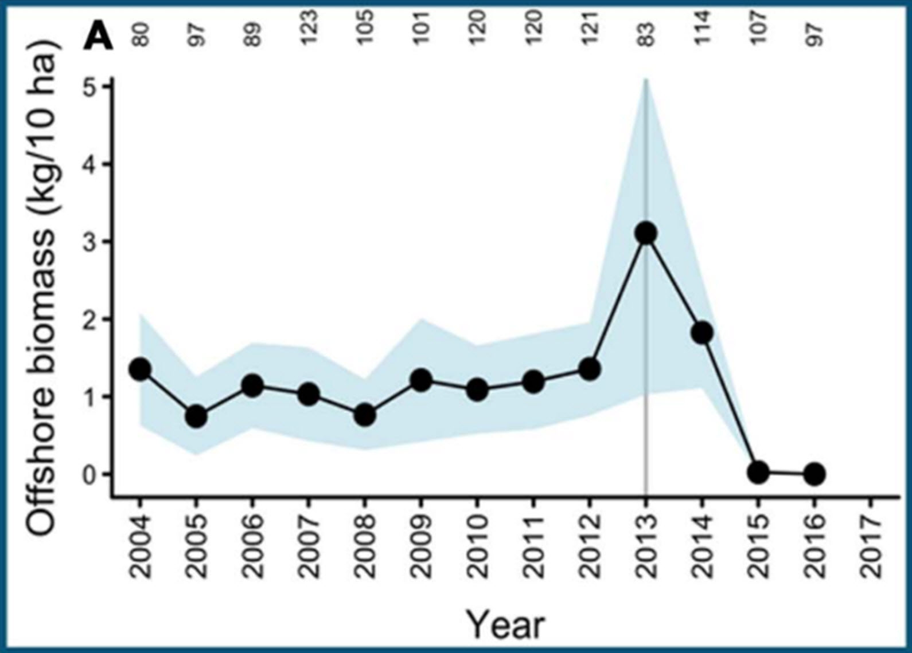

- [info_link](https://olympiccoast.noaa.gov/living/marinelife/inverts/inverts.html)
- [info_photo_link](https://sanctuarysimon.org/dbtools/photo-library/id/6662/pycnopodia/helianthoides/sunflower-star/)
- [info_tagline](Without any sunlight it's hard to imagine corals (and sponges) thriving in the deep ocean. And yet, deep sea corals and sponges make up vital habitat for many fishes and invertebrates around the world.)

# {.tabset}

## Trends - sunflower star

