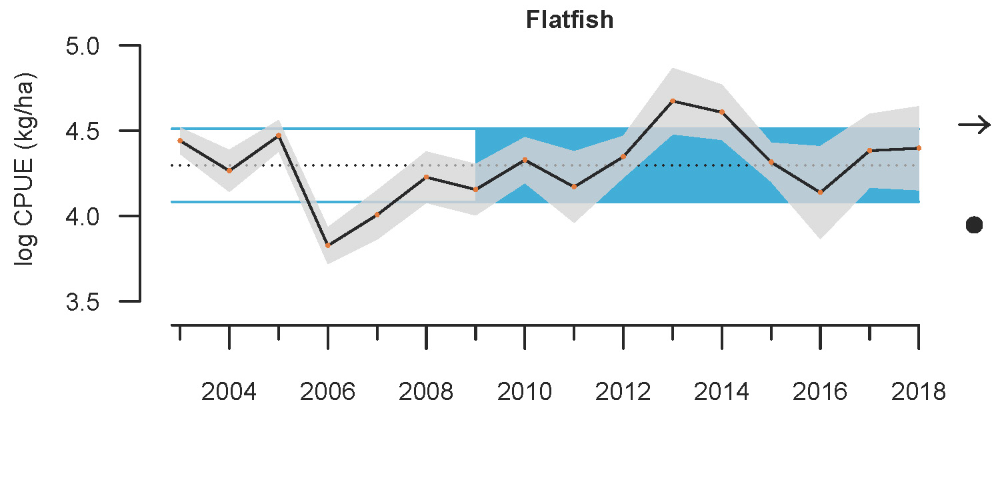

- [info_link](https://olympiccoast.noaa.gov/living/marinelife/fish/fish.html)
- [info_photo_link](https://olympiccoast.noaa.gov/library/pixpages/librarypixpg_flounder.html)
- [info_tagline](Flatfish are exactly what they sound like: fish with thin, oval or diamond-shaped bodies that lie flat on the seafloor. They are important predators of small seafloor invertebrates, and are prey for sharks and marine mammals...and many are caught by humans as well.)

# {.tabset}

## Trends - abundance

