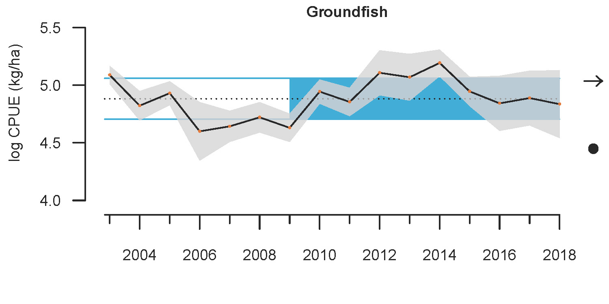
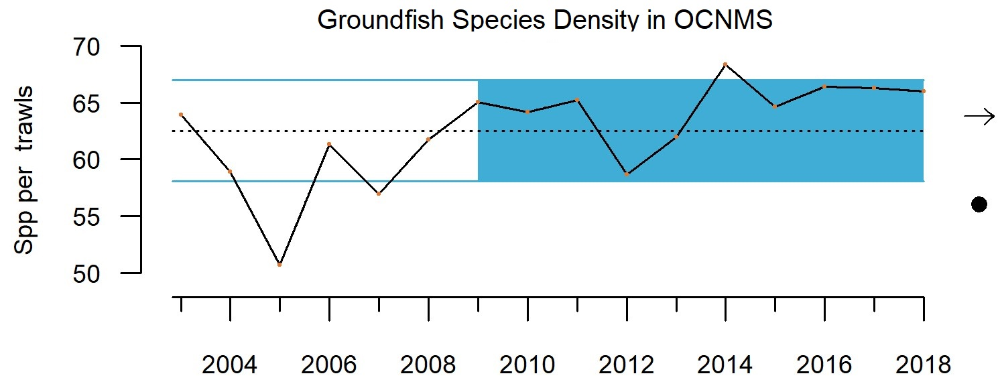
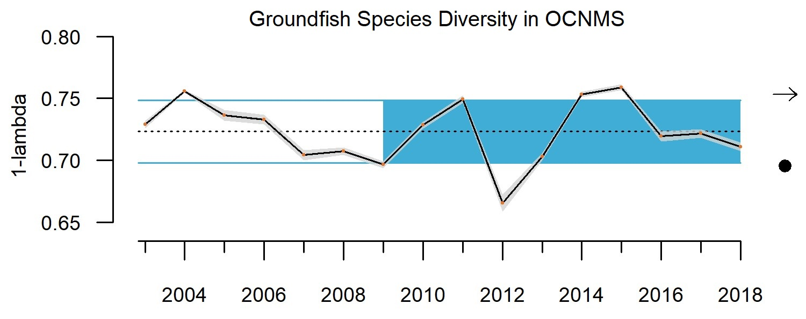
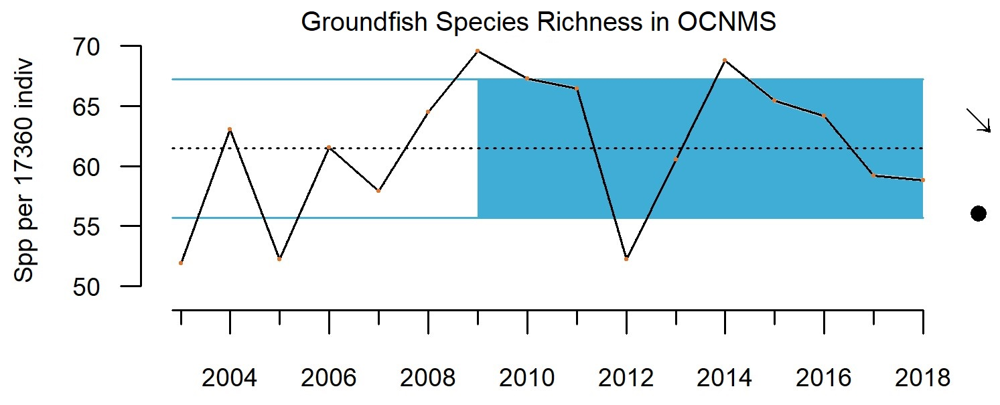

- [info_link](https://olympiccoast.noaa.gov/living/marinelife/fish/fish.html)
- [info_tagline](Groundfish includes more than 90 different types of fish that live on or near the bottom of the ocean, including flatfish, rockfish, sharks, and skates off the West Coast. These fish are harvested in both non-tribal and tribal commercial fisheries and recreational fisheries.)

