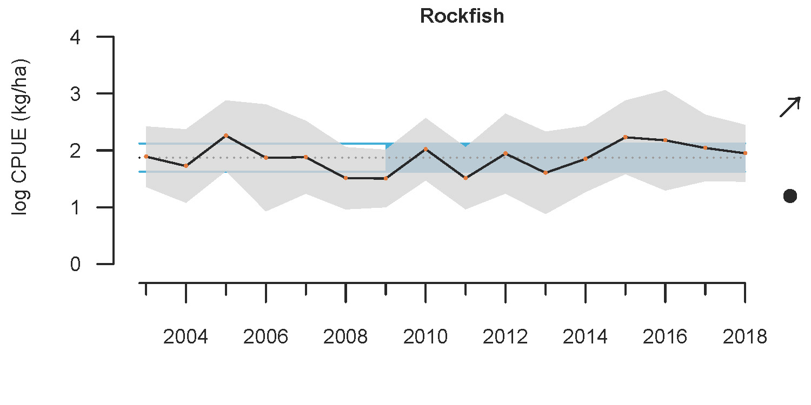
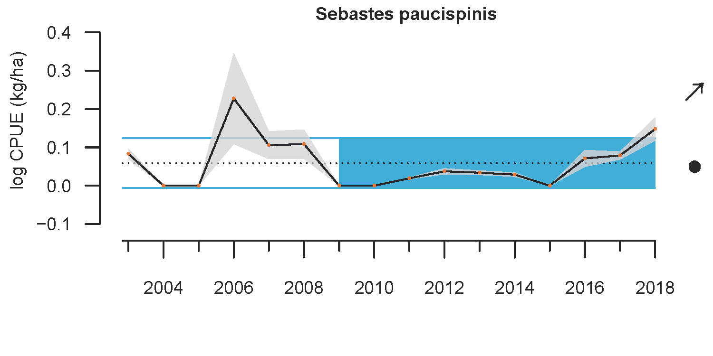
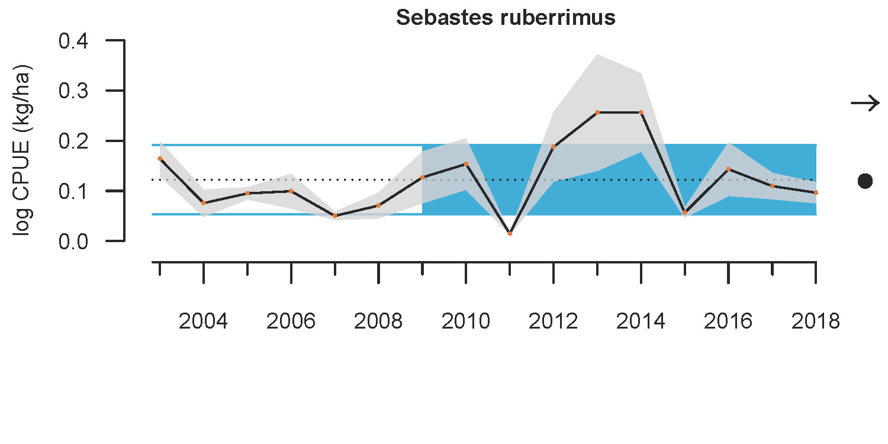

- [info_link](https://olympiccoast.noaa.gov/living/marinelife/fish/fish.html)
- [info_photo_link](https://olympiccoast.noaa.gov/library/pixpages/librarypixpg_chinarockfish.html)
- [info_tagline](Rockfish is a term used for nearly sixty species in the fish family of Sebastidae. Rockfishes come in various shapes, sizes, and colors with interesting names such as vermillion, chilipepper, blue, black, or gopher.)

# {.tabset}

## Trends - abundance all rockfish

## Trends - abundance bocaccio

## Trends - abundance yelloweye rockfish

