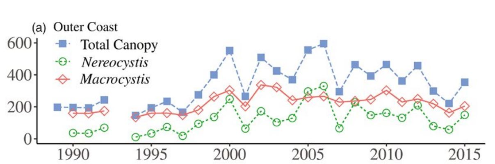

- [info_link](https://oceanservice.noaa.gov/facts/kelp.html)
- [info_photo_link](https://sanctuaries.noaa.gov/pgallery/pgolympic/habitats/habitats_1.html)
- [info_tagline](The two dominant canopy-forming kelp species along the Olympic coast are giant kelp and bull kelp. Kelp canopies provide places to attach for some invertebrates, refuges for fish, and food for sea urchins. The amount of kelp canopy in an area influences the abundance of many associated species in that area, including sea otters.)

### {.tabset}

#### Trends

