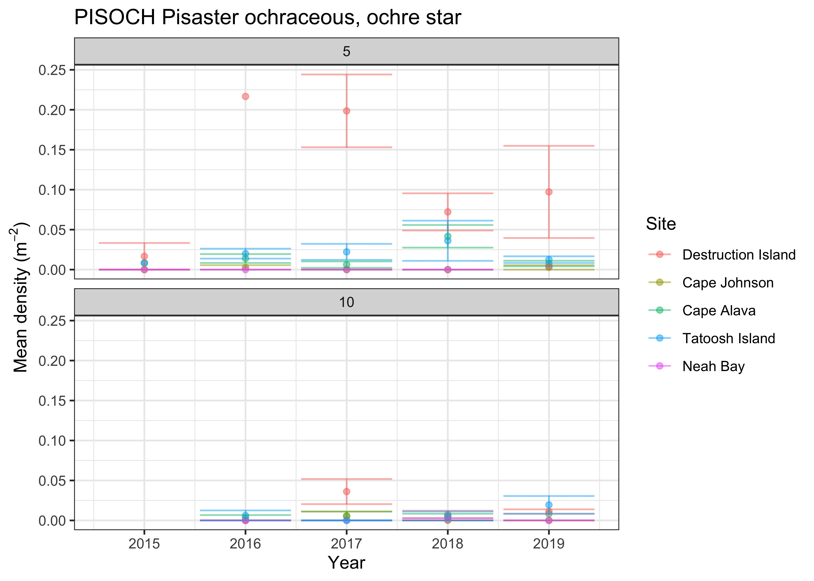

- [info_link](https://olympiccoast.noaa.gov/living/marinelife/inverts/inverts.html)
- [info_photo_link](https://olympiccoast.noaa.gov/library/pixpages/librarypixpg_sunstar.html)
- [info_tagline](Don't let their slow movement fool you, sea stars are an important part of kelp forests. Some are fierce predators, while others are vital decomposers. Species in the genus Pisaster and Pycnopodia are considered to be keystone because loss of these sea stars can lead to changes in community structure or function, such as more sea urchins and less kelp in kelp forests.)

# {.tabset}

## Trends - sunflower star

## Trends - ochre star

