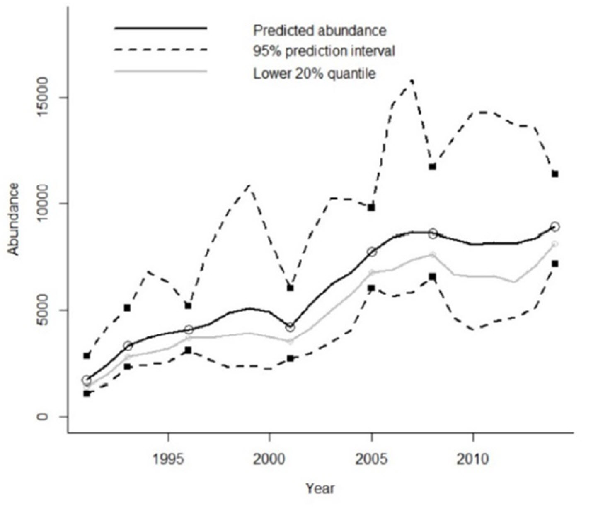
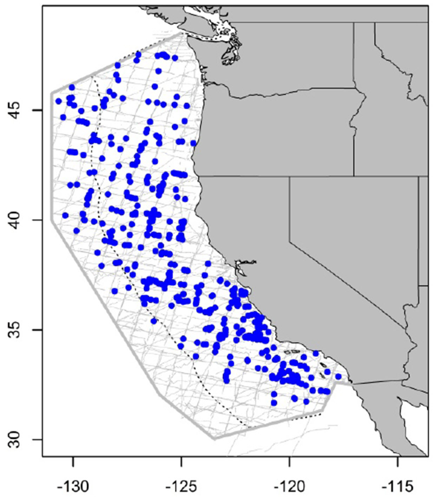
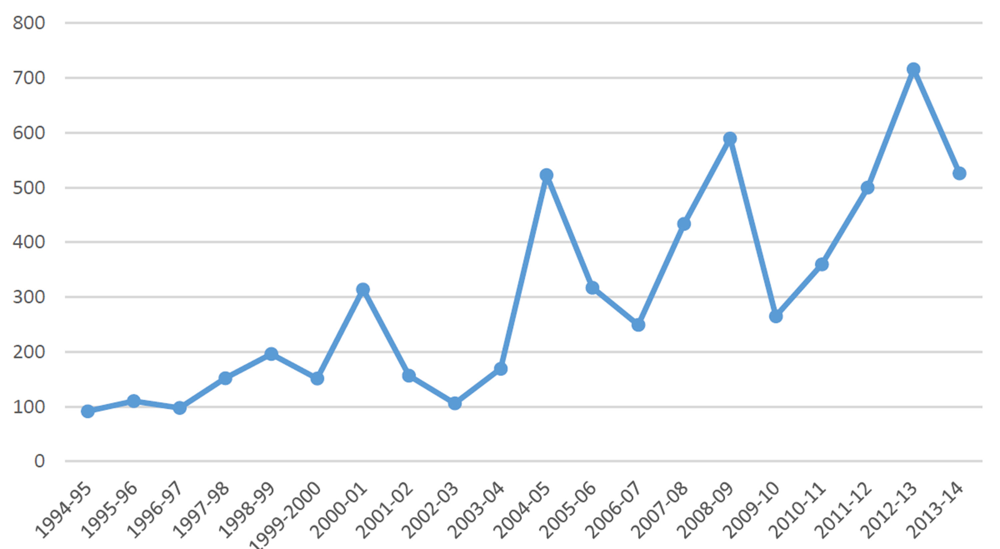
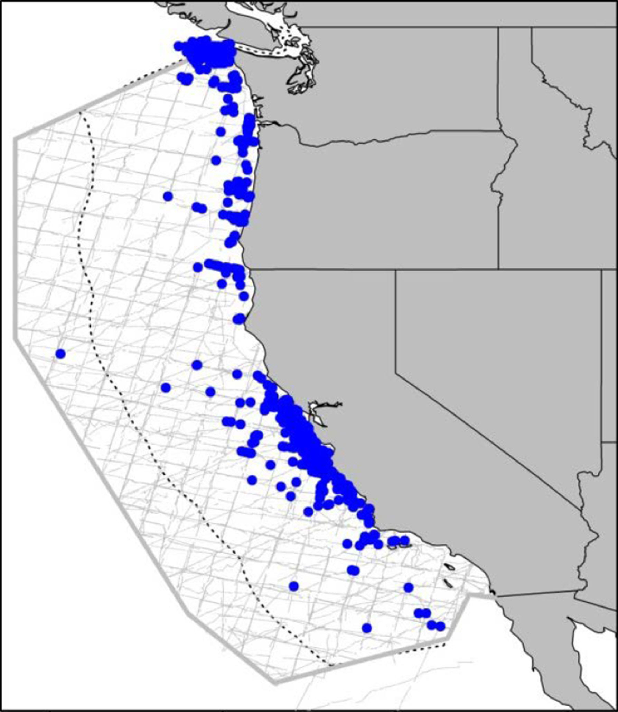
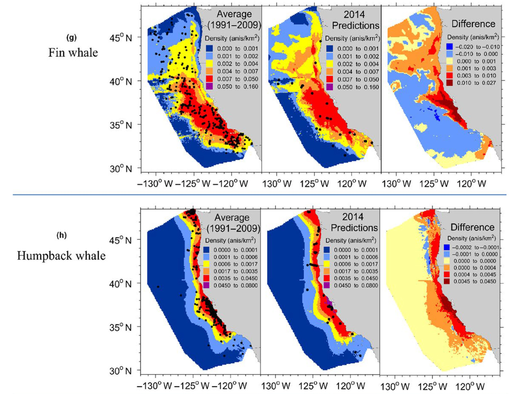
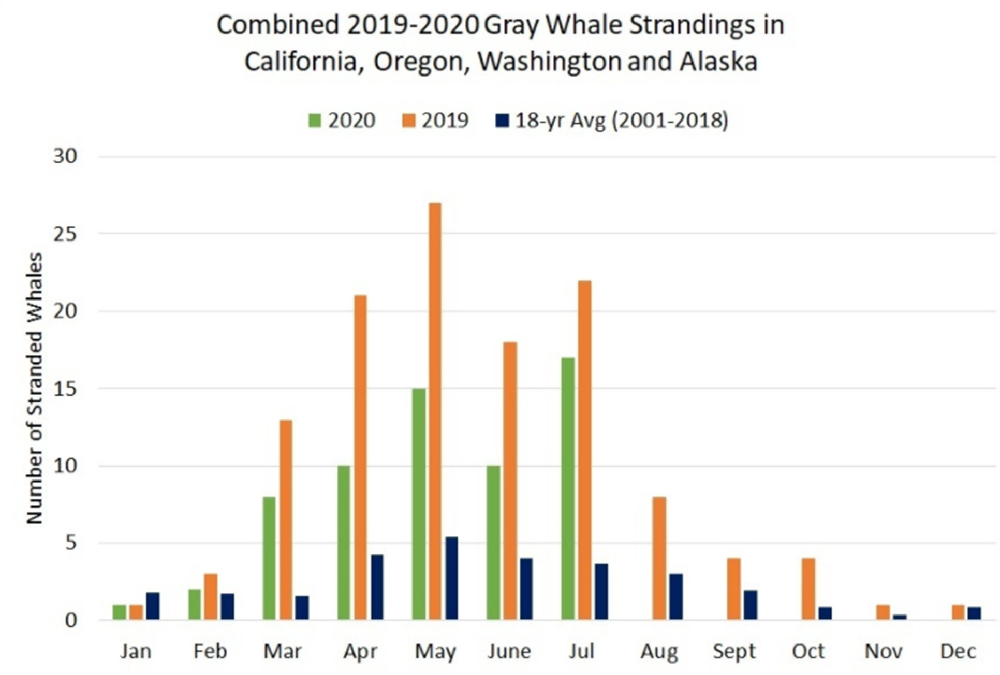

- [info_link](https://olympiccoast.noaa.gov/living/marinelife/mammals/mammals.html)
- [info_photo_link](https://olympiccoast.noaa.gov/library/pixpages/librarypixpg_humpback.html)
- [info_tagline](Marine mammals in the cetacean family include whales, dolphins and porpoises.)

