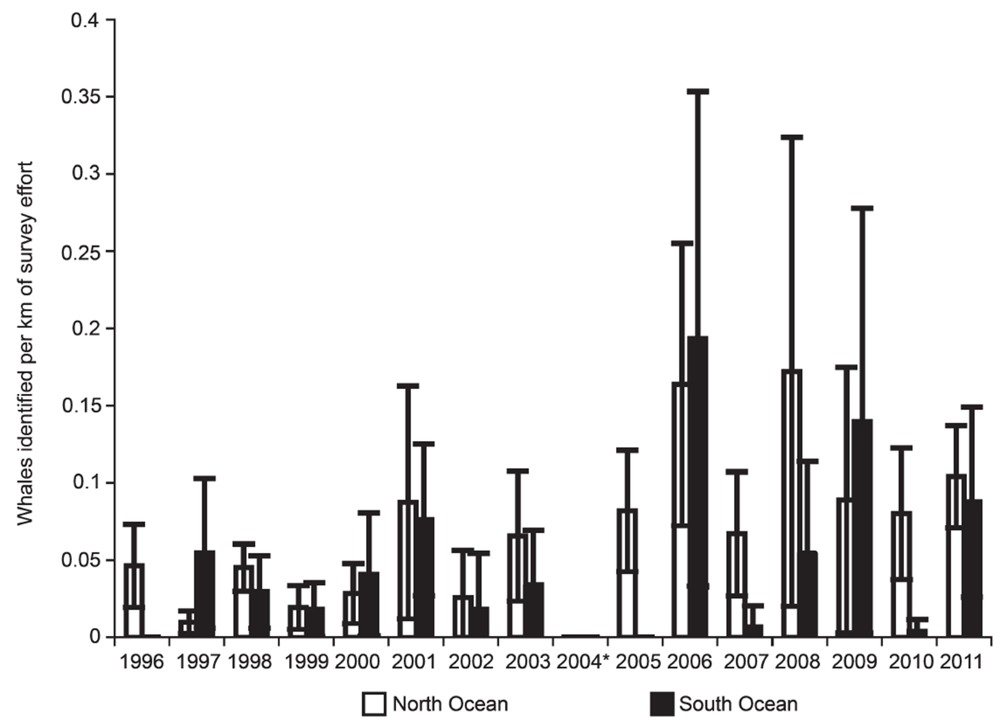

- [info_link](https://olympiccoast.noaa.gov/living/marinelife/mammals/mammals.html)
- [info_photo_link](https://olympiccoast.noaa.gov/library/pixpages/librarypixpg_humpback.html)
- [info_tagline](Marine mammals in the cetacean family include whales, dolphins and porpoises.)

# {.tabset}

## Trends - gray whales

## Trends - fin whale

## Maps - fin whale

## Trends - humpback whale

## Maps - humpback whales

## Maps - density comparison

## Trends - gray whale strandings

