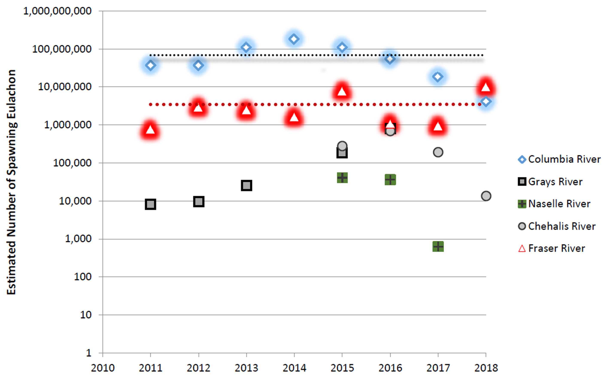

- [info_link](https://olympiccoast.noaa.gov/living/marinelife/fish/fish.html)
- [info_tagline](Eulachon have many other names—smelt, hooligan, oolichan, and fathom fish. They are an anadromous smelt moving between freshwater and saltwater. First Nations people fish for eulachon by traditional methods for use as an important subsistence food and medicine.)

# {.tabset}

## Trends - abundance spawners

