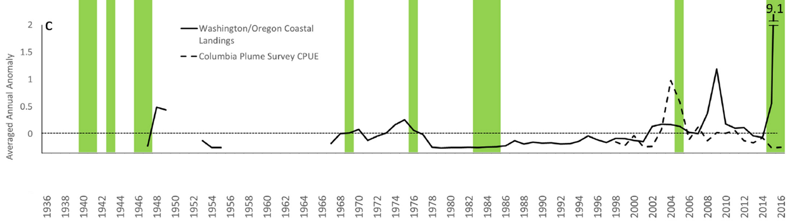
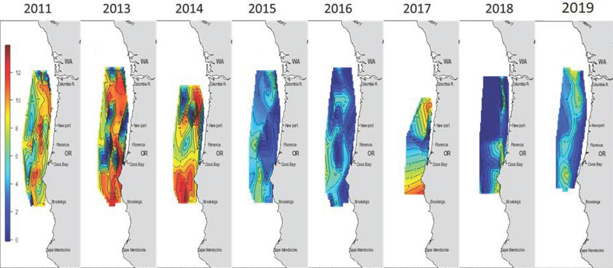

- [info_link](https://olympiccoast.noaa.gov/living/marinelife/fish/fish.html)
- [info_tagline](Forage fish, also called prey fish or bait fish, are small fishes that are important food for larger predators including larger fish, seabirds, sea lions and whales. Forage fish, such as anchovies and sardines, feed near the base of the food chain on plankton.)

