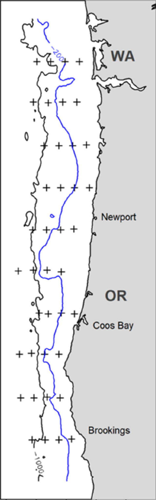
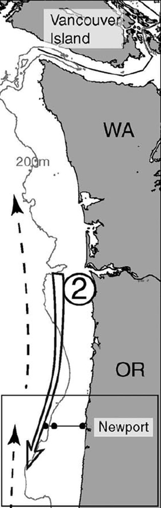
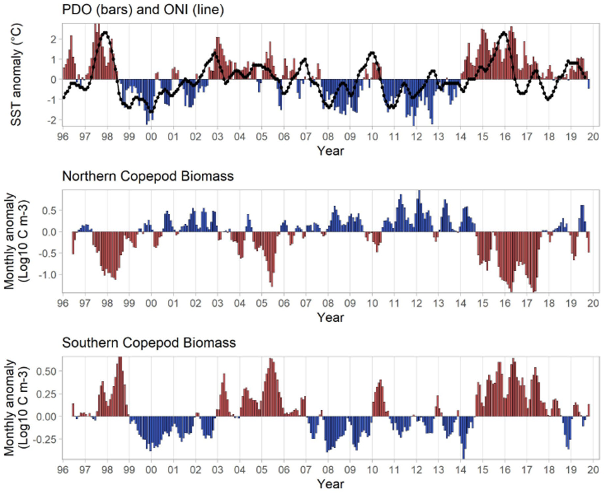
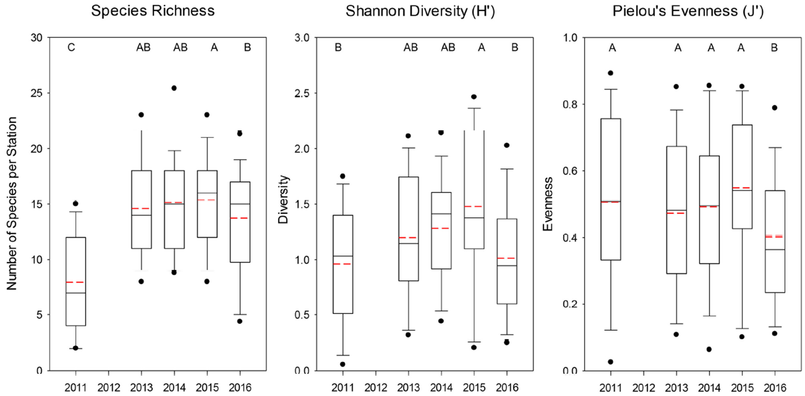
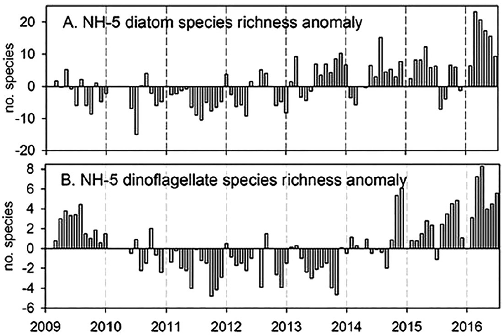

```{r setup, include=F}
knitr::opts_chunk$set(echo=F, message=F, warning=F, error=F)
source(here::here("infographiqR.R"))
```

`r insert_info(csv = here::here("data/gsheets/modals.csv"))`


### {.tabset}

#### Maps - larvae and zooplankton stations



#### Maps - phytoplankton



#### Trends - copepods



#### Trends - larvae and zooplankton diversity



#### Trends - phytoplankton diversity


