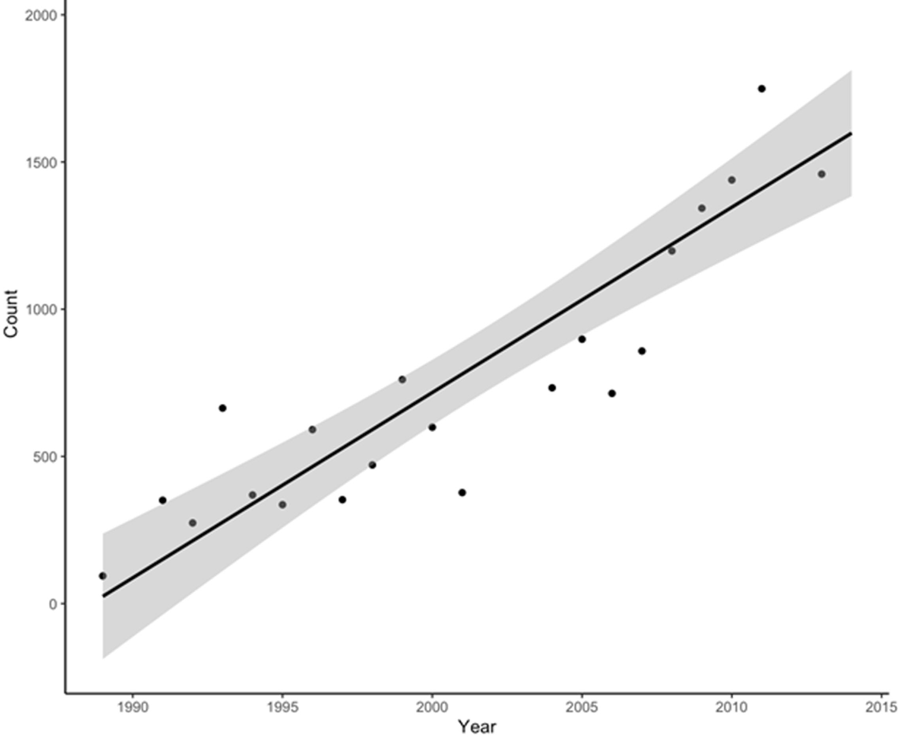
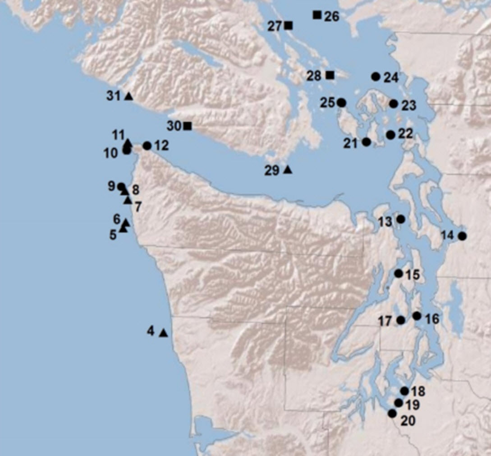
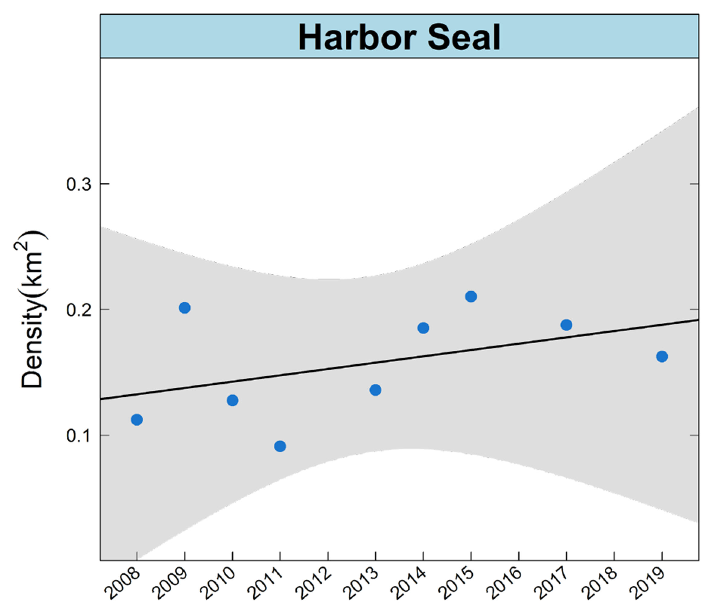

- [info_link](https://olympiccoast.noaa.gov/living/marinelife/mammals/mammals.html)
- [info_photo_link](https://olympiccoast.noaa.gov/library/pixpages/librarypixpg_sealions.html)
- [info_tagline](Seals and sea lions are pinnipeds and they are some of the most charismatic mammals along the Olympic Coast.)

