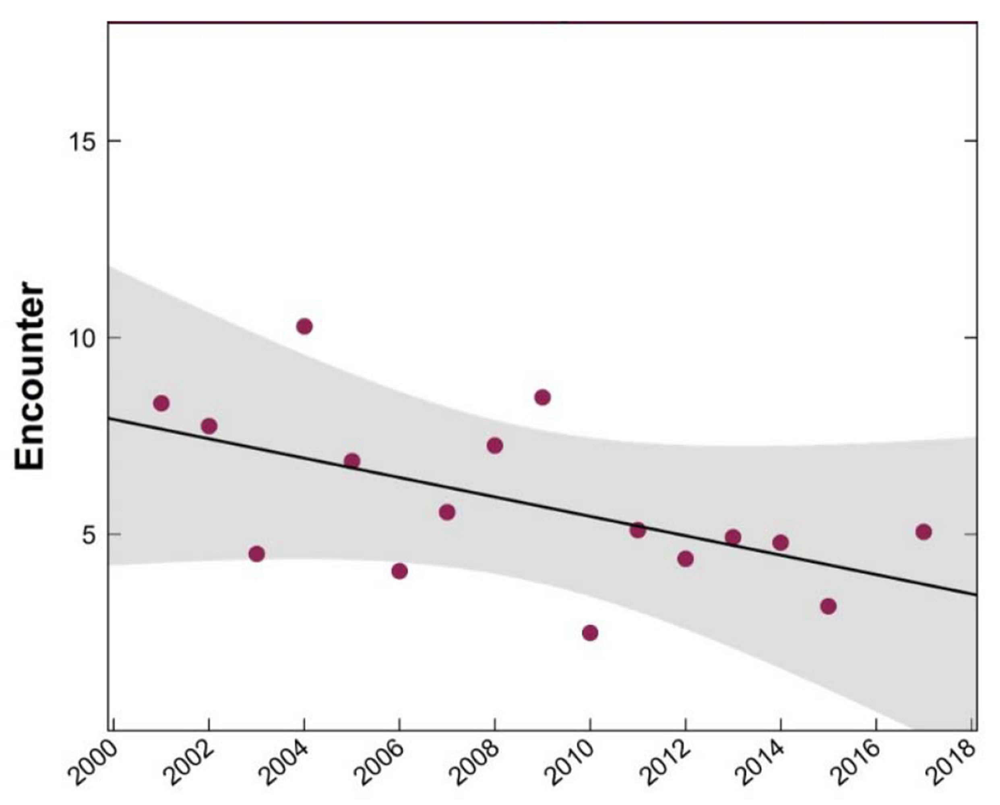
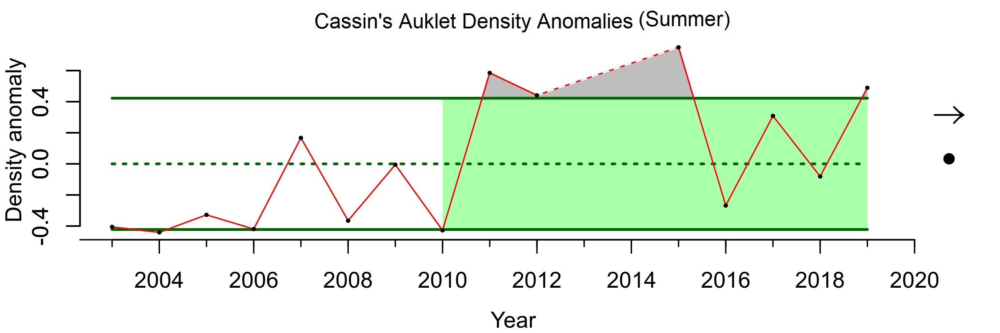
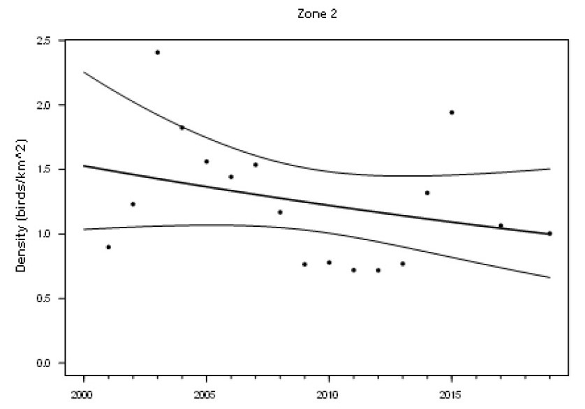
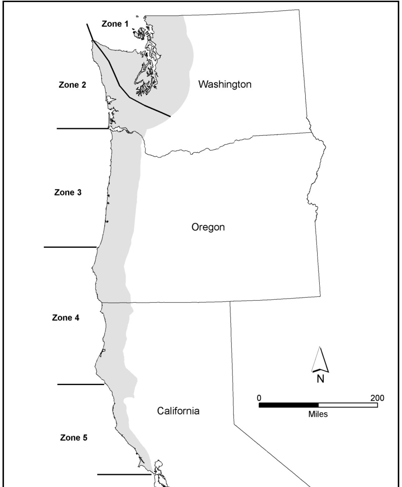
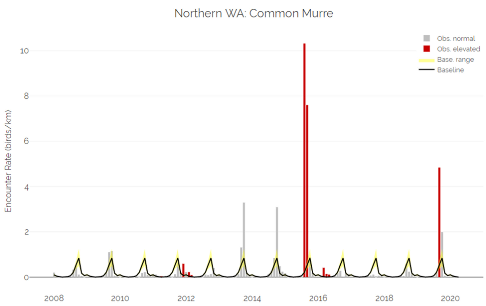
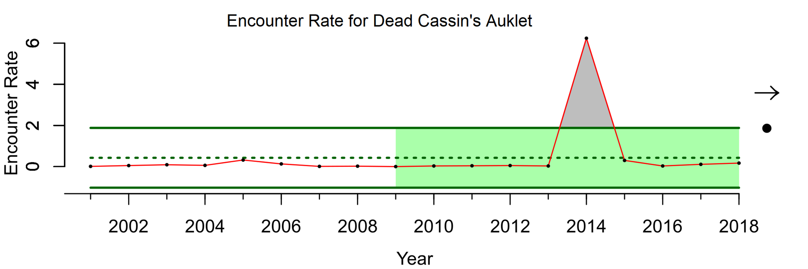

- [info_link](https://olympiccoast.noaa.gov/living/marinelife/birds/birds.html)
- [info_photo_link](https://olympiccoast.noaa.gov/library/pixpages/librarypixpg_albatross.html)
- [info_tagline](The Olympic Coast is home to a rich variety of seabirds, from migratory birds who use the islands as a stopover to year-round residents.)

# {.tabset}

## Trends - Tufted Puffin

## Trends - Cassin's Auklet

## Trends - Marbled Murrelet

## Maps - Marbled Murrelet

## Trends - Common Murre carcasses

## Trends - Cassin's Auklet carcasses

