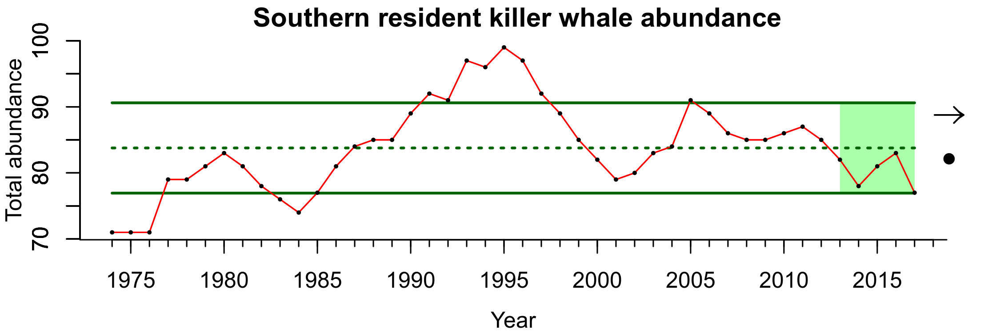

- [info_link](https://www.fisheries.noaa.gov/west-coast/endangered-species-conservation/southern-resident-killer-whale-orcinus-orca)
- [info_photo_link](https://olympiccoast.noaa.gov/library/pixpages/librarypixpg_orca.html)
- [info_tagline](Southern Resident killer whales spend several months of the summer and fall each year in Washington State's Puget Sound. This population was listed as endangered in 2005 under the Endangered Species Act. Three main causes of the decline of Southern Residents are: reduced quantity and quality of prey, persistent organic pollutants, and noise and disturbance from vessels.)

# {.tabset}

## Trends - killer whales

