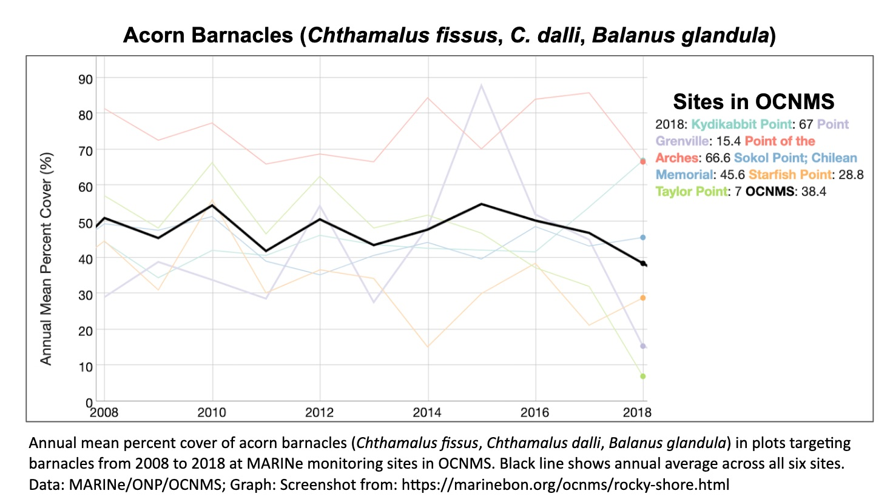

- [info_link](https://olympiccoast.noaa.gov/living/marinelife/inverts/inverts.html)
- [info_tagline](Acorn barnacles typically dominate the high intertidal zone along the Olympic Coast. They can help create conditions that are favorable to some types of native algae. Acorn barnacles are highly vulnerable to smothering from oil spills because floating oil often sticks along the uppermost tidal levels.)

### {.tabset}

#### Trends - MARINe

