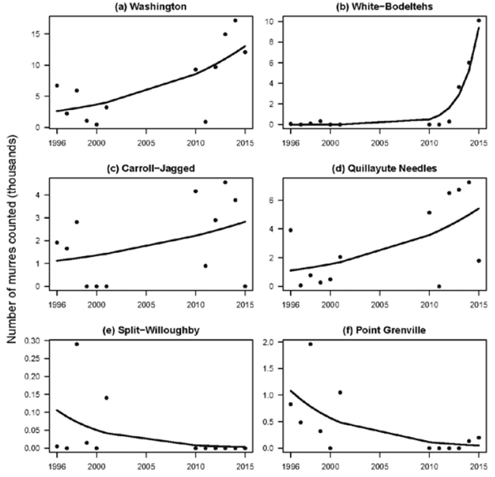

- [info_link](https://olympiccoast.noaa.gov/living/marinelife/birds/birds.html)
- [info_photo_link](https://olympiccoast.noaa.gov/library/pixpages/librarypixpg_murres.html)

### {.tabset}

#### Trends - Common Murre colony

