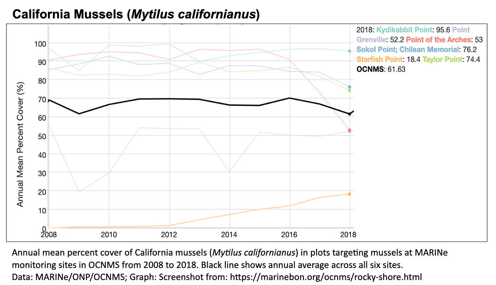
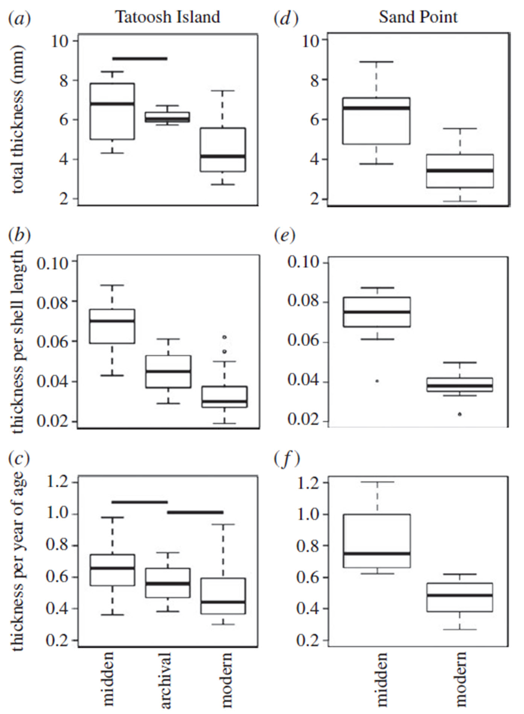

- [info_link](https://olympiccoast.noaa.gov/living/marinelife/inverts/inverts.html)
- [info_photo_link](https://sanctuarysimon.org/dbtools/species-database/id/474/)
- [info_tagline](Although they may resemble the rocks they're found on, mussels are very much alive. These filter-feeders can form large dense beds that provide habitat for many other species. Mussels are an important food source for many animals, including ochre stars, snails, and humans.)

### {.tabset}

#### Trends - abundance

#### Trends - condition

