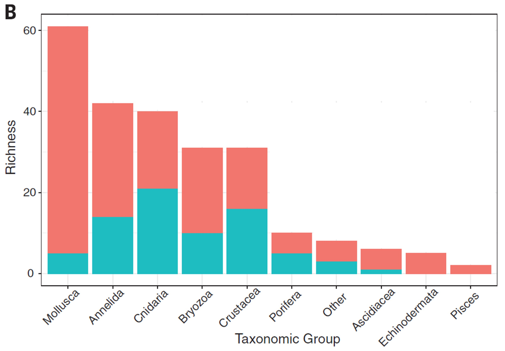
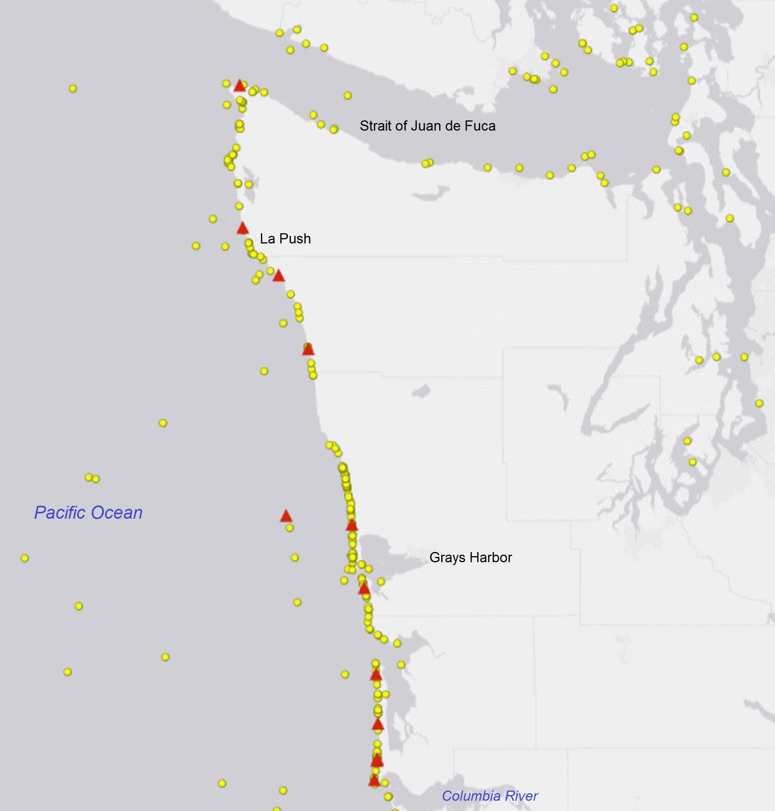

- [info_link](https://sanctuaries.noaa.gov/science/sentinel-site-program/olympic-coast/invasive-species.html)
- [info_tagline](Our rocky shores can be impacted by the arrival of species from other parts of the world. Some non-indigenous species are disruptive to ecosystems and others aren't. Some algae and invertebrates have the potential to be invasive by out-competing native rocky shore species.)

# {.tabset}

## 2011 Tsunami

## Maps - 2011 Tsunami

