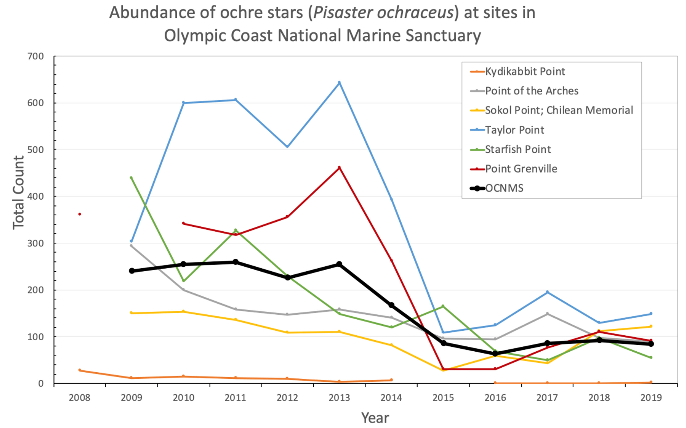
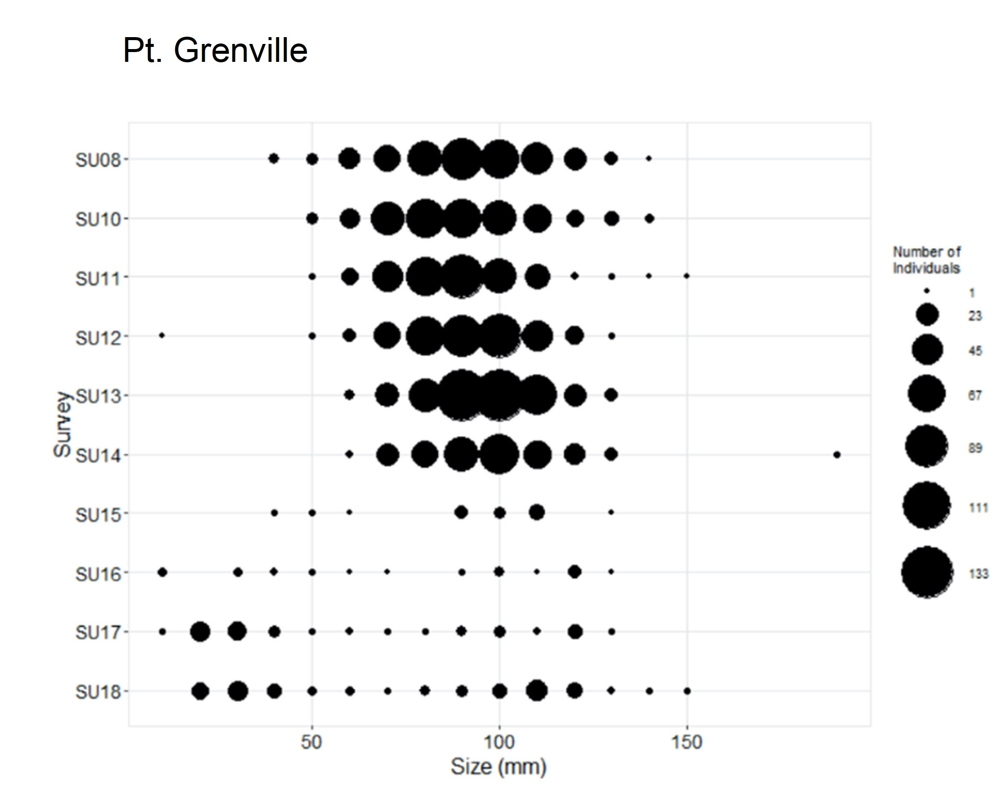
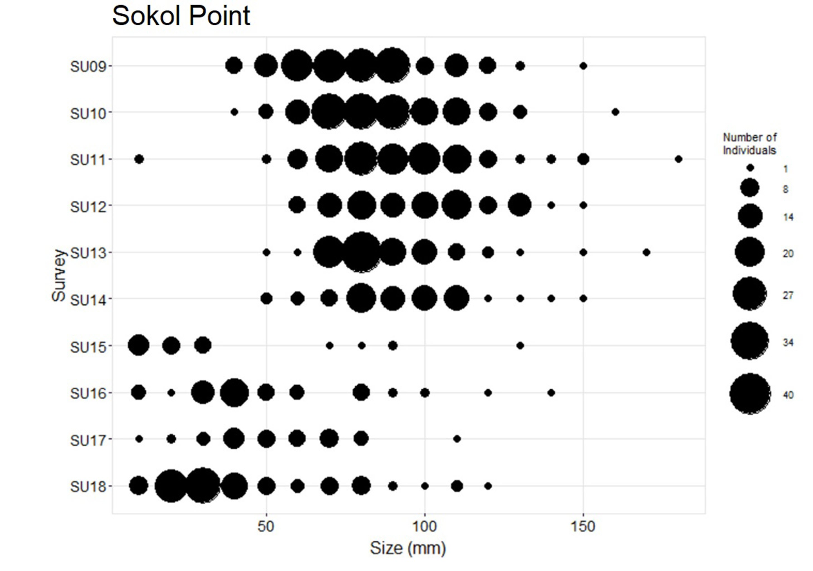
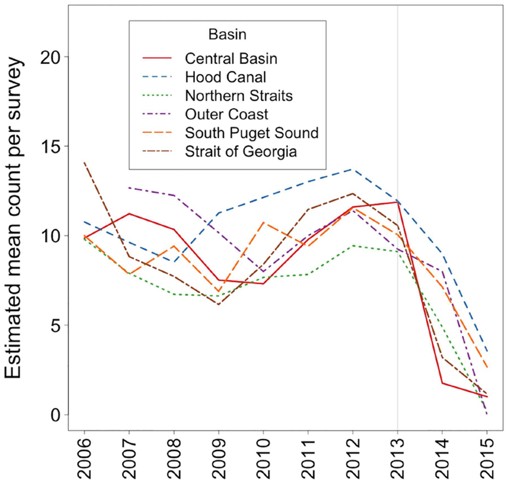

- [info_link](https://sanctuarysimon.org/dbtools/species-database/id/55)
- [info_photo_link](https://olympiccoast.noaa.gov/library/pixpages/librarypixpg_ochrestars.html)
- [info_tagline](Don't let their slow movement fool you, sea stars play an important role along the rocky shore. Some are fierce predators, while others are vital decomposers. Species in the genus Pisaster and Pycnopodia are considered to be keystone because loss of these sea stars can lead to changes in community structure or function, such as expansion of mussel beds along the rocky shore and more sea urchins and less kelp in kelp forests.)

# {.tabset}

## Trends - abundance (MARINe)

## Trends - status & condition

## Trends - size at Pt. Grenville

## Trends - size at Sokol Point

## Trends - sunflower star

