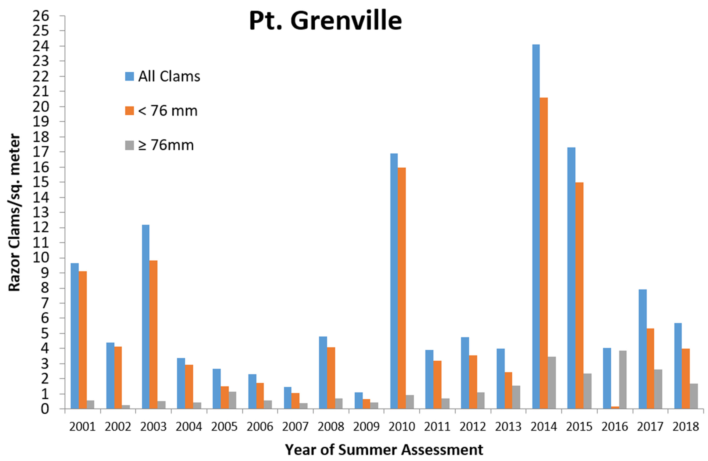
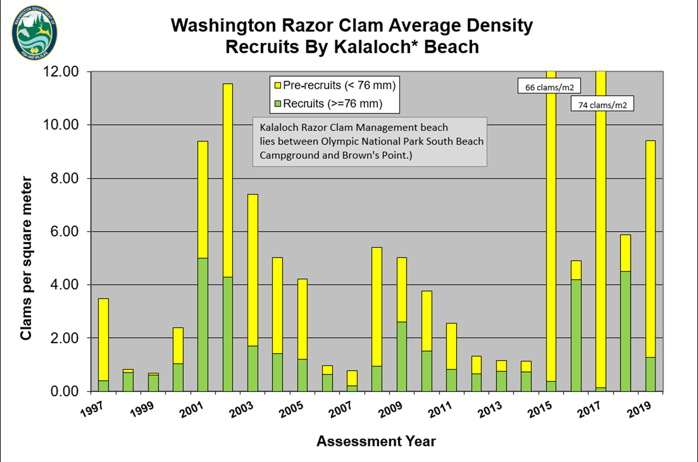
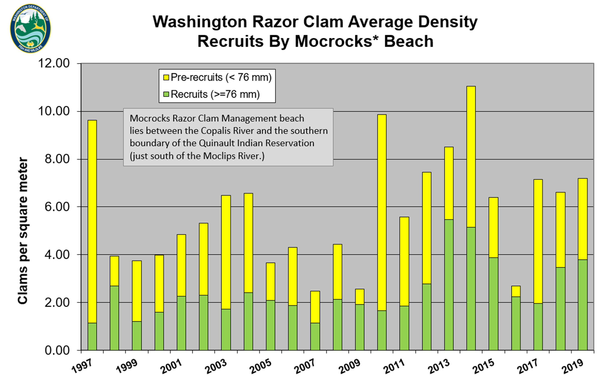

- [info_link](https://olympiccoast.noaa.gov/living/marinelife/inverts/inverts.html)
- [info_photo_link](https://wdfw.wa.gov/species-habitats/species/siliqua-patula)
- [info_tagline](The Pacific razor clam is an exceptionally meaty shellfish, with a narrow, oblong shell, and is one of the most sought after shellfish in the state of Washington. Razor clams are found primarily on the intertidal coastal beaches (those that are exposed at low tide). They are also a food for wildlife including shorebirds and sea otters.)

