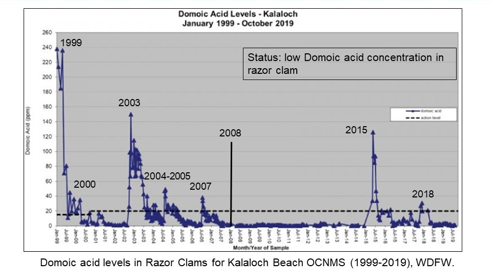

### {.tabset}

#### Trends - biotoxin closures

#### Trends - CCIEA Mocrocks DA

#### Trends - DA all beaches (CCIEA)

#### Trends - Kalaloch Domoic Acid Levels

#### Trends - Mocrocks Domoic Acid Levels

